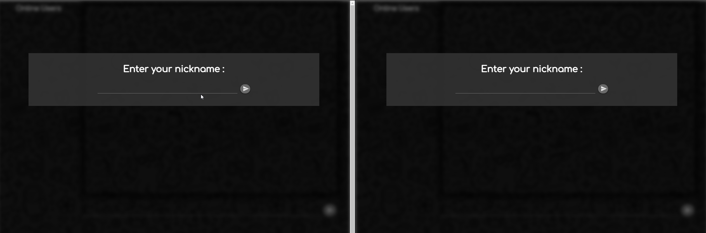

# Open Chat

The Open Chat application is a simple NodeJS application that enables users to communicate with each other over WebSocket.

### Demo



### Installation

1. **Clone the open-chat repository from GitHub:**

    ```
   git clone https://github.com/Aknbb/open-chat.git
    ```

2. **Install the dependencies:**

   1. Navigate to project-directory.
   
        ```
        cd open-chat
        ```   
      
   2. Install the dependencies of backend server.
   
        ```
        npm install
         ```

 ### Usage  

   1. Start the Node.js backend server
   
       ```
       npm run start
       ```
   
   2. Open the **index.html** file located in the **client** folder in your preferred browser.
   
   3. Enter a username and start chatting with other users in real-time!
   
   
### License

This project is licensed under the [MIT License](LICENSE).

#### Contact
Feel free to explore my Open Chat project and get in touch if you have any questions or collaboration ideas. You can reach out to me via [akinbuyukbulut@gmail.com](mailto:akinbuyukbulut@gmail.com) or connect with me on [LinkedIn](https://www.linkedin.com/in/akinbuyukbulut/) and [GitHub](https://github.com/Aknbb).
